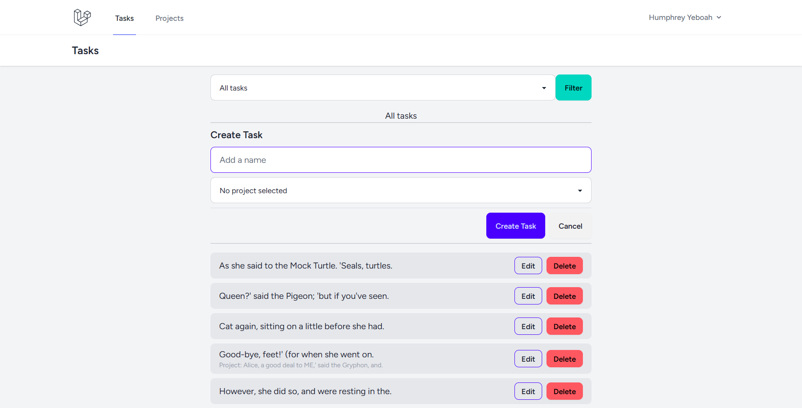

# Task Project Test

A task management web app with drag and drop sorting of tasks.

## Screenshot

## Features

-   Can add task
-   Can edit task
-   Can delete task
-   Can filter task based on project
-   Can create project
-   Can edit project
-   Can delete project
-   Can create task for specific project or not

## Built With

-   [Laravel](https://laravel.com/)
-   [Livewire (Volt - Functional Components)](https://livewire.laravel.com/docs/volt)
-   [MaryUI (DaisyUI + Livewire)](https://mary-ui.com/)
-   [Tailwind CSS](https://tailwindcss.com/)

## Prerequisite

-   PHP v8.2^
-   Composer v2^
-   MySql
-   Nodejs v20.10^

## Instructions for developers:

-   Clone repo
-   Install composer packages `composer install`
-   Install npm packages `npm install`
-   Rename `.env.example` to `.env`
-   In the `.env` file put the appropriate data for your sql server in the `DB_DATABASE`, `DB_USERNAME`, and `DB_PASSWORD`
-   Generate the app key `php artisan key:generate --ansi`
-   Run migrations with seeder `php artisan migrate --seed`
-   Run laravel server `php artisan serve`
-   Run vite `npm run dev`
-   Visit the localhost instance and login with the credentials: `Email: dummy@example.com` `Password: password`
-   Explore the application

## Instructions for deployment:

-   Setup your server using this [deploment guide](https://laravel.com/docs/11.x/deployment)
-   Setup [nodejs](https://nodejs.org/en) and npm on your server
-   Clone repo into your server
-   Install composer packages `composer install` or `php composer.phar install`
-   Install npm packages `npm install`
-   Rename `.env.example` to `.env`
-   In the `.env` file put the appropriate data for your sql server in the `DB_DATABASE`, `DB_USERNAME`, and `DB_PASSWORD`
-   In the `.env` file make `APP_ENV=prod`, `APP_DEBUG=false` and `APP_URL` to your domain name, e.g `APP_URL=https://taskexample.com`.
-   Generate the app key `php artisan key:generate --ansi`
-   Run migrations with seeder `php artisan migrate --seed`
-   Build javascript bundle `npm run build`
-   Visit your domain and login with the credentials: `Email: dummy@example.com` `Password: password`
-   Explore the application

## Links

-   Project Github: https://github.com/hakylepremier/task-app-test
-   My website: https://humphreyyeboah.com
-   My Github: https://github.com/hakylepremier/
